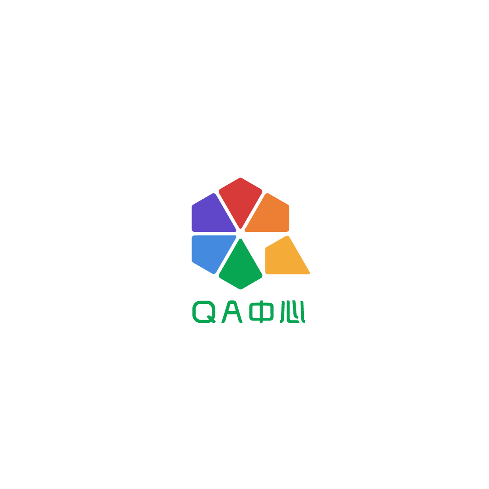

  
# 代码安全规则集合
  

&emsp;&emsp;  
&emsp;&emsp;本项目由360质量工程部主导，将编程时需要注意的问题总结成若干规则，可为制定编程规范提供依据，也可为代码审计或相关培训提供指导意见，意在提升软件产品的可靠性、健壮性、可移植性以及可维护性，从而提升软件产品的综合安全系数。  

&emsp;&emsp;目前主要面向C和C++语言，适用于桌面、服务端及嵌入式软件系统：

&emsp;&emsp;[c-cpp-rules.md](https://github.com/Qihoo360/safe-rules/blob/main/c-cpp-rules.md)：C/C++相关规则的详细说明文档  
&emsp;&emsp;[c-cpp-rules.json](https://github.com/Qihoo360/safe-rules/blob/main/c-cpp-rules.json)：C/C++相关规则的结构化json文档  

&emsp;&emsp;紧随语言标准，融汇C++ Core Guidelines、SEI CERT、MISRA等权威规范体系，并持有独特的观点，为软件开发及测试等相关团队提供准确而全面的指引是本项目的宗旨。欢迎指正错误并提供扩展意见，由于本项目相关文档是自动生成的，请不要直接编辑各文档，可在Issue区发表高见，管理员修正数据库后会在致谢列表中存档。  

&emsp;&emsp;如有任何疑问，欢迎致信：g-cqm-admin@360.cn
